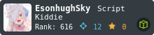

# Hi there 👋

## - Intro

this is Esonhugh Skyworship's Github 

📫 How to reach me: <github@eson.ninja> or [Telegram](https://t.me/esonhugh_skywalker)

🌱 I’m currently learning Security.

Thank u for your watching and star.

## - Info: [Esonhugh's Blog](https://eson.ninja/)

  <!--  -->

## - Tech Stack

  

    <h3> Core </h3>
    
  

  

  <h3> Shell like </h3>
  <!-- bash -->
  
  <!-- powershell -->
  
  

  

  <h3> Lang like </h3>
  <!-- golang -->
  
  <!-- python -->
  
  

  

  <h3> Cloud Native </h3>
  <!-- docker -->
  
  <!-- k8s -->
 
  <!-- cloud -->
  
  

  <h3> Misc </h3>
  <!-- web -->
  
  <!-- cisco -->
  

  <!-- For more icons please follow  https://github.com/MikeCodesDotNET/ColoredBadges -->
  <!--
  
  
  
  

  
  
  
  
  
  
-->
  
## - Badge:

<!--
**Esonhugh/Esonhugh** is a ✨ _special_ ✨ repository because its `README.md` (this file) appears on your GitHub profile.
Here are some ideas to get you started:
- 🔭 I’m currently working on ...
- 🌱 I’m currently learning ...
- 👯 I’m looking to collaborate on ...
- 🤔 I’m looking for help with ...
- 💬 Ask me about ...
- 📫 How to reach me: ...
- 😄 Pronouns: ...
- ⚡ Fun fact: ...
-->
