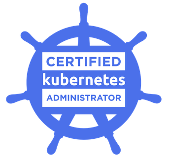
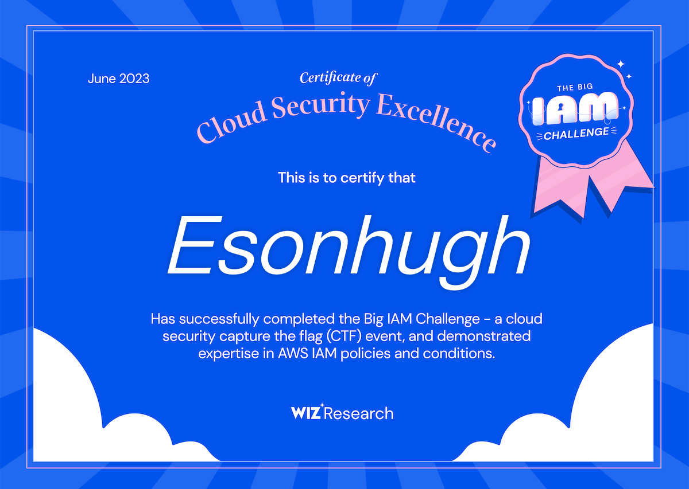
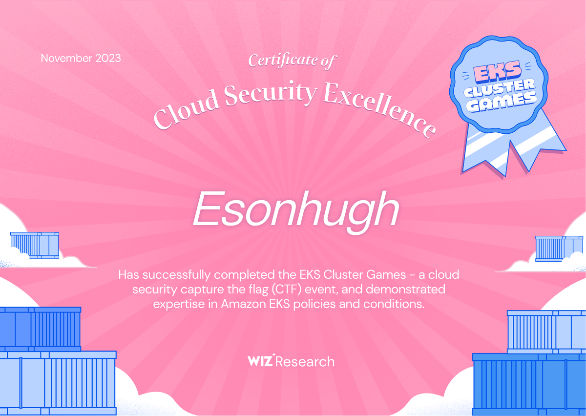
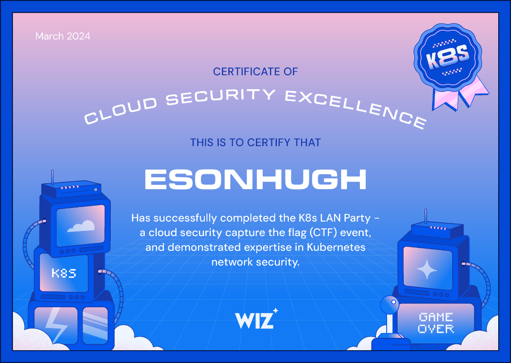

# Hi there 👋

## - Intro

this is Esonhugh Skyworship's Github 

📫 How to reach me: <github@eson.ninja> or [Telegram](https://t.me/esonhugh_skywalker)

🌱 I’m currently learning Security.

Thank u for your watching and star.

## - Sponsor

[Patreon](https://www.patreon.com/Skyworshiper) - paid documents articles.

..To Be continue.

## - Badge:

||||
|---|---|---|
||||

<!--

<h5 style="text-align:center">BigIAMChallenge</h5>

<h5 style="text-align:center">EKSClusterGame</h5>

<h5 style="text-align:center">K8s-Lan-Party</h5>

-->

## - Vulnerabilities (CVE/SRC):

- [Tencent Src](https://security.tencent.com/index.php/user/p/FC955A65213EFD9B0DC0BE1A74FF3BF9) - 腾讯 Src 个人主页
- [CVE-2022-27103](https://www.cvedetails.com/cve/CVE-2022-27103/) - Element-plus show-overflow-tooltip XSS

## - Articles You never want miss:

- [Attack Code](https://github.com/Esonhugh/Attack_Code)
- [Devstream ConfigFile Command Injection Sink](https://github.com/Esonhugh/Devstream-ConfigFile-Command-Injection)
- [AI Enhanced Pentesting](https://github.com/Esonhugh/AI-Enhanced-hacking)
- [my cloud security articles](https://github.com/Esonhugh/My-Cloud-Security)
- [How AI kills the vshell](https://github.com/Esonhugh/How-AI-Kills-the-VShell)

## - I'm also write some codes ;)

### - Tools 

- [Shell Script manager - ShellScriptSnippet aka SSS ](https://github.com/Esonhugh/ShellScriptSnippet)
- [Weaponized VSCode Project workspace with python msf and other hack tools](https://github.com/Esonhugh/CreateHackingEnv)
- [Ticket Master/Token Master for forged Token/Ticket/Cookie in Cloud/VirtualMachine Platforms](https://github.com/Esonhugh/TicketMaster)
- [Kubernetes low priv enumeration tool (no need service account)](https://github.com/Esonhugh/k8spider)
- [Gopherus3 Python3 gopherus](https://github.com/Esonhugh/Gopherus3)
- [ProxyInBrowser - XSS exploitation with Websocket, which create http proxy to relay request via victim browser](https://github.com/Esonhugh/ProxyInBrowser)
- [ConsoleHook - a tool for you to analyze obfed javascript frontends](https://github.com/esonhugh/ConsoleHook)
- [Sliver TCP Stager helper - for Windows staged payload and linux staged pauload generator and hoster](https://github.com/Esonhugh/sliver-stage-helper)

### - "API" SDK (unstable) And Skeleton Project

- [(template) Wails + Skeleton sveltekit ui](https://github.com/Esonhugh/wails-skeleton-template)
- [(template) Go Cilium ebpf prog starter](https://github.com/Esonhugh/ebpf_cilium_starter)
- [(template) Go cobra cli tools template](https://github.com/Esonhugh/fast-cli-template)
- [ \[Out of Date\] Openai platform API for API Key management](https://github.com/Esonhugh/OpenAI-Platform-API)
- [Tencent Coding API](https://github.com/Esonhugh/tencent-coding-openapi)

### - POC Based

- [\[SelfUse\] Metasploit modules](https://github.com/Esonhugh/Self-Metasploit)
- [\[SelfUse\] Nuclei templates](https://github.com/Esonhugh/public-nuclei-template)
- [ebpf sshd hook backdoor](https://github.com/Esonhugh/sshd_backdoor)
- [Bad Zip file creator of testing Zip slip and Zip file read](https://github.com/Esonhugh/ZipperTestingUtils)
- [Evil Sln project with MsBuild Old Trick](https://github.com/Esonhugh/EvilSlnProject)
- [Aliyun CTF Email Spoofing POC](https://github.com/Esonhugh/AliyunCTF-Email-Spoofing-DKIM-Creator)
- [XSS in ChatGPT Web Settings](https://github.com/Esonhugh/ChatGPT-Web-Setting-Funny-Abuse)
- [GitHack-like tools hack back via git LFI](https://github.com/Esonhugh/GitBeHacked)

- [APISIX Gateway Webshell](https://github.com/Esonhugh/apisix-webshell-rce)
- [Yapi Webshell](https://github.com/Esonhugh/yapi-rce-webshell)

- [Ingress Nightmare - kubernetes ingress controller remote rce exploitation](https://github.com/Esonhugh/ingressNightmare-CVE-2025-1974-exps)

### - Flipperzero developping

- [KDF sample](https://github.com/Esonhugh/flipper_kdf)
- [UFBT Application Guide](https://github.com/Esonhugh/flipperzero_ufbt_application_howto)

### - Helm Charts

- [BBRF framework in Kubernetes](https://github.com/Esonhugh/bbrf-server-helm-chart)

## - Metrics

<!--
**Esonhugh/Esonhugh** is a ✨ _special_ ✨ repository because its `README.md` (this file) appears on your GitHub profile.
Here are some ideas to get you started:
- 🔭 I’m currently working on ...
- 🌱 I’m currently learning ...
- 👯 I’m looking to collaborate on ...
- 🤔 I’m looking for help with ...
- 💬 Ask me about ...
- 📫 How to reach me: ...
- 😄 Pronouns: ...
- ⚡ Fun fact: ...
-->
